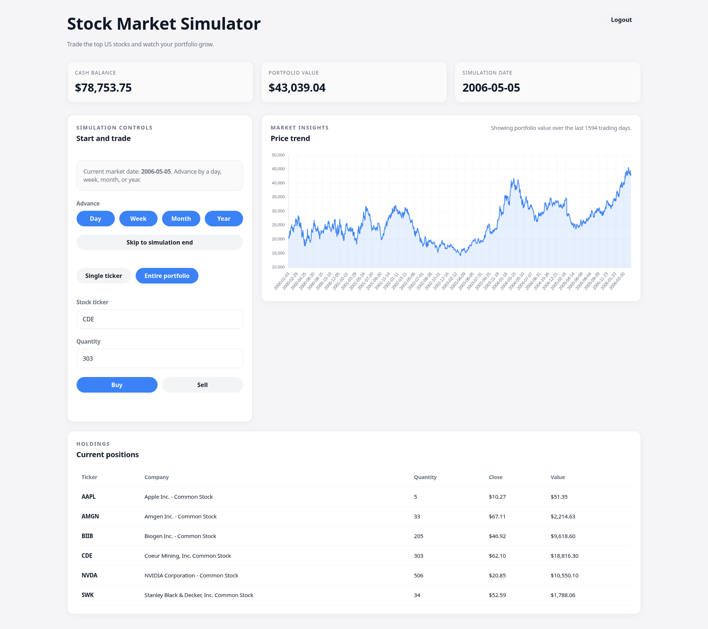
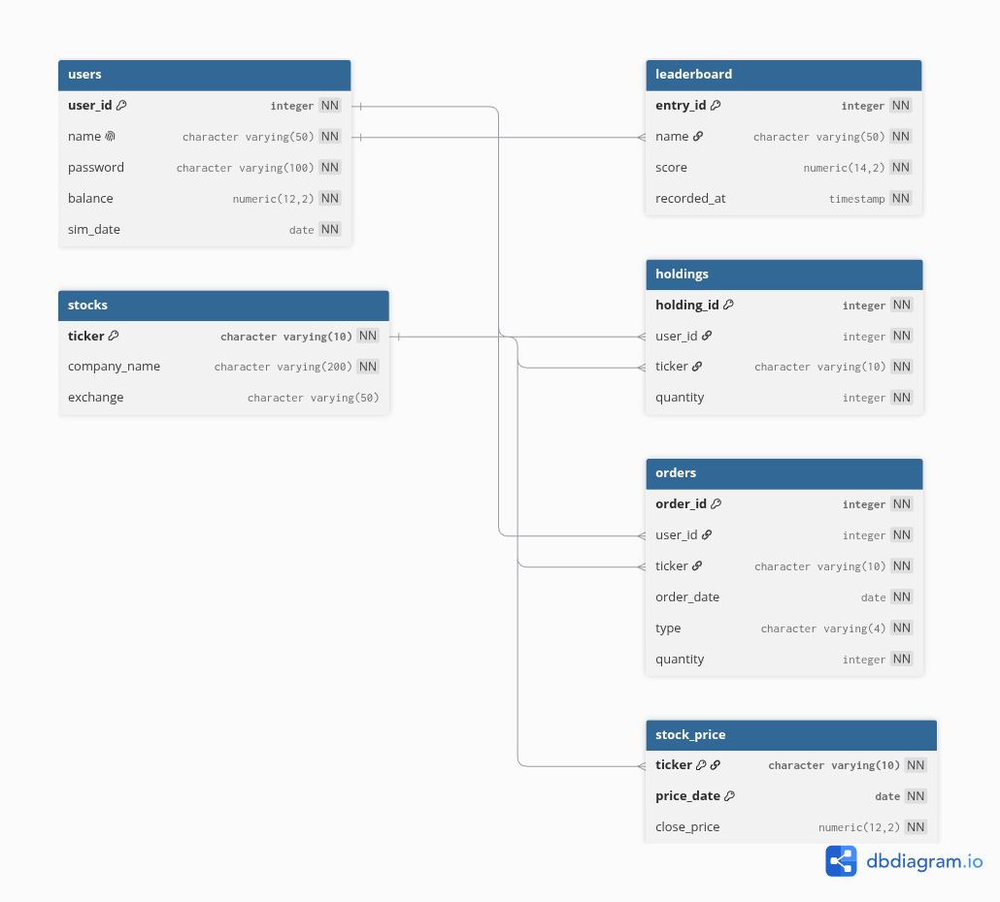

# DiS-Project - Stock Market Simulator Webapp
## Table of Contents
- [E/R Diagram](#er-diagram)
- [Setup and run the application locally](#setup-and-run-the-application-locally)
  - [Requirements](#requirements)
  - [1. Install dependencies](#1-run-the-code-below-to-install-dependencies)
  - [2. Download the stock-price history dataset](#2-download-the-stock-price-history-dataset)
  - [3. Configure and build the database](#3-configure-and-build-the-database)
  - [4. Run the flask application](#4-run-the-flask-application)
- [How to use the app](#how-to-use-the-app)
  - [1. Create Account](#1-create-account)
  - [2. Login](#2-login)
  - [3. Dashboard Overview](#3-dashboard-overview)
  - [4. Buy/Sell Stocks](#4-buysell-stocks)
  - [5. Leaderboard](#5-leaderboard)
- [AI Declaration](#AI-Declaration)

---

*Preview of the website*

This project envelops building a working stock market simulator where a user can trade stocks and compete with users to get the highest score on a leaderboard.

The project built using PostgreSQL, CSS for styling, and indirectly javascript through dashboard.html and Chart.js, as an external library for the stock graph. Finally, flask as the web framework. Hereby routing, request/response, sessions, HTML templating using Jinja2. The web application is built with the application-factory pattern + blueprints (modular route groups)

## E/R Diagram


*The E/R-diagram*

The E/R diagram has been generated using sql2dbml to convert it to a file that can be parsed by [dbdiagram.io](dbdiagram.io). It has been double-checked to match the database structure/logic thereafter. 
### Notes
The project is also hosted live using an isolated docker container:
[dis-project.archmage.science](https://dis-project.archmage.science).

Use of AI is also declared in [`declaration.txt`](`declaration.txt`).
## Setup and run the application locally 
### Requirements
- Python (tested on 3.14 and 3.11)
- A running local PostgreSQL server
- Commands createdb / psql available
- Torrent client for downloading the dataset containing stock-price history
- ~2.1gb of free space for the datasets  


### 1. Run the code below to install dependencies. 
```bash
python -m venv venv
source venv/bin/activate               (venv/Scripts/activate on windows)
pip install -r src/requirements.txt
```
### 2. Download the stock-price history dataset
On AcademicTorrents: [Download](https://academictorrents.com/details/c5a49e46249fef6a3219919fef96fd0265da4d3a) the .torrent and import on a torrent client.

After having downloaded the dataset from academictorrents using a torrent client:

Unzip to `src/endofday.sql`.
### 3. Configure and build the database

In `src/build_database.py`, change `DUMP_FILE` from "`endofday.sql`" to the file's full path.
Before running the build script, create the PostgreSQL db named in ```build_database.py```

IF you need to adjust db connection, edit DB_NAME, DB_USER, DB_HOST and DB_PORT in build_database.py
The app connects with the settings hardcoded in
[`website/__init__.py`](website/__init__.py):

```python
'host': 'localhost', 'dbname': 'portfolio_app',
'user': 'postgres', 'password': '...'
```

then run
```
python src/build_database.py
```
This should take ~3 minutes.

The project directory should now look something like this:
```bash
> tree
.
├── declaration.txt
├── e-r-diagram.png
├── LICENSE
├── main.py
├── page.png
├── README.md
├── src
│   ├── build_database.py
│   ├── database.sql
│   ├── endofday.sql
│   ├── match_exchanges.py
│   ├── nasdaqlisted.txt
│   ├── otherlisted.txt
│   ├── requirements.txt
│   ├── schema.sql
│   └── ticker_info.txt
└── website
    ├── auth.py
    ├── db.py
    ├── __init__.py
    ├── templates
    │   ├── dashboard.html
    │   ├── login.html
    │   └── register.html
    └── views.py
```
### 4. Run the flask application  

```bash
python main.py
```
The website should now be running on [localhost:3025](http://localhost:3025)

## How to use the app
### 1. Create Account
Click the register account option, and provide a username and password

### 2. Login
Login with the account credentials

### 3. Dashboard Overview
Once logged in, you'll see your portfolio with:
- Cash Balance
- Net Worth; the total value of all your holdings at current stok prices
- Current Date; The simulation date starts at 2000-01-03
- Holdings; A list of stocks you own with theyr quantity, price, and total value

### 4. Buy/Sell Stocks
Enter the ticker of a stock you wanna buy/sell

Enter the quantity, and choose to either sell or buy

Advance with the time control buttons (+Day, +Week, +Month, +Year)

Before ending the simulation, make sure to sell all holdings.
### 5. Leaderboard
After ending the simulation, the user gets locked, and the score is recorded on the leaderboard.

## AI Declaration
Use of AI has been used to build and review the following code:
* Creating build_database.py for building the database based on the E/R-diagram. 
* Finding errors in code and execution
* Modifying view.py to fix bugs
* CSS-styling
* Moved balance/sim_date from session into DB columns (schema + auth.py + views.py); removed the manual "start simulation" step so accounts begin at 2000-01-03. This should've probably been caught by us in the first place - Placing the start-date outside of the database was a bad decision.
* Date-filtered the stock combobox to only show stocks trading on the current sim date.
* Diagnosed and fixed live-DB schema drift (missing balance/sim_date columns); updated src/schema.sql to match.
* Leaderboard panel on login/register pages.

AI-output was reviewed/tested before keeping.

Additionally Claude has rewritten dashboard.html and views.py.
The user-written code was originally made to be server-rendered, which required the page to reload when doing anything. To make a quick turnaround we opted to generate using Claude


